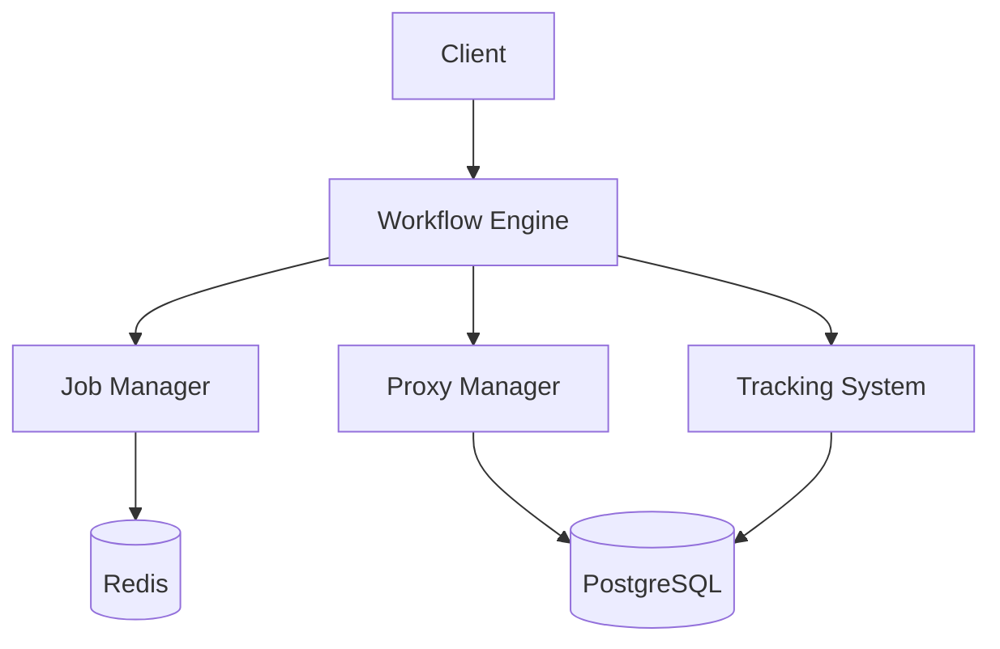

# Herd

A powerful workflow management system for Ruby applications.

## Overview

Herd is a workflow management system that helps you coordinate and execute complex job sequences. It provides a robust framework for managing job dependencies, parallel execution, and state persistence.

## Features

- **Workflow Management**: Create and manage complex job workflows
- **Job Dependencies**: Define job dependencies and execution order
- **Parallel Execution**: Run jobs in parallel using proxies
- **State Persistence**: Store workflow state in PostgreSQL
- **Job Queue**: Manage job execution through Redis and Sidekiq
- **Tracking System**: Monitor workflow and job execution
- **Error Handling**: Robust error handling and retry mechanisms
- **Configuration**: Flexible configuration options

## Installation

Add this line to your application's Gemfile:

```ruby
gem 'herd'
```

And then execute:

```bash
$ bundle install
```

## Quick Start

```ruby
# Define a workflow
class MyWorkflow < Herd::Workflow
  def configure
    run PrepareJob
    run FetchDataJob, after: PrepareJob
    run ProcessDataJob, after: FetchDataJob
    run SaveDataJob, after: ProcessDataJob
  end
end

# Create and run a workflow
workflow = MyWorkflow.create
workflow.run
```

## Documentation

For detailed documentation, please visit our [documentation site](doc/README.md):

- [Architecture Overview](doc/architecture/overview.md)
- [Core Components](doc/architecture/components.md)
- [Data Storage](doc/architecture/storage.md)
- [Process Flows](doc/architecture/flows.md)
- [Configuration Guide](doc/configuration/README.md)
- [API Reference](doc/api/README.md)
- [Development Guide](doc/development/README.md)

## Architecture

Herd uses a hybrid storage approach:
- Redis for job management and queues
- PostgreSQL for state persistence and tracking

### System Components



## Configuration

Configure Herd in your application:

```ruby
Herd.configure do |config|
  config.redis_url = "redis://localhost:6379/1"
  config.database_url = "postgresql://localhost:5432/herd"
  config.log_level = :info
  config.job_timeout = 30
  config.max_retries = 5
  config.enable_tracking = true
end
```

## Development

After checking out the repo, run `bundle install` to install dependencies. Then, run `rake test` to run the tests.

## Contributing

1. Fork it
2. Create your feature branch (`git checkout -b my-new-feature`)
3. Commit your changes (`git commit -am 'Add some feature'`)
4. Push to the branch (`git push origin my-new-feature`)
5. Create new Pull Request

## License

The gem is available as open source under the terms of the MIT License.
